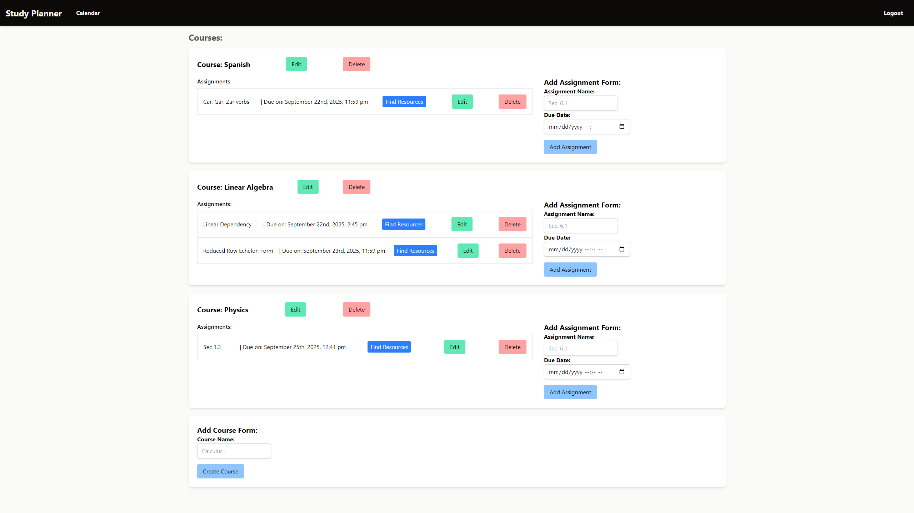
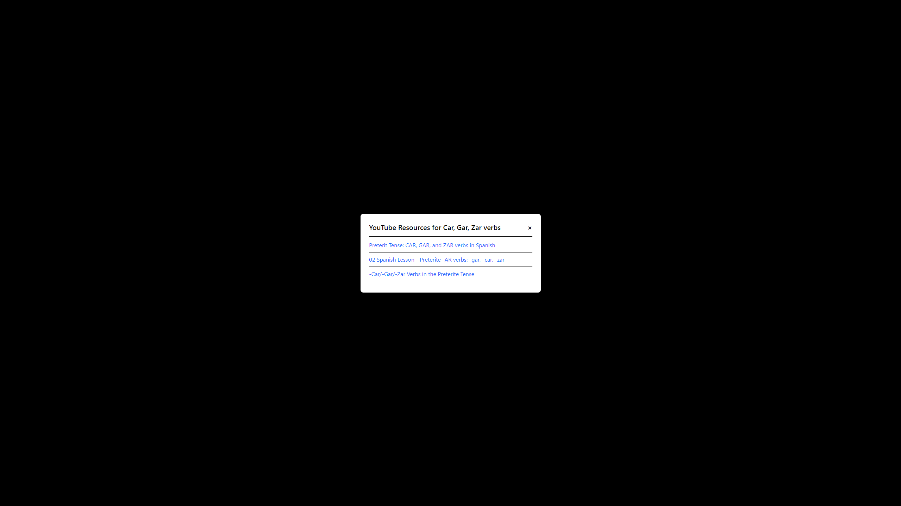
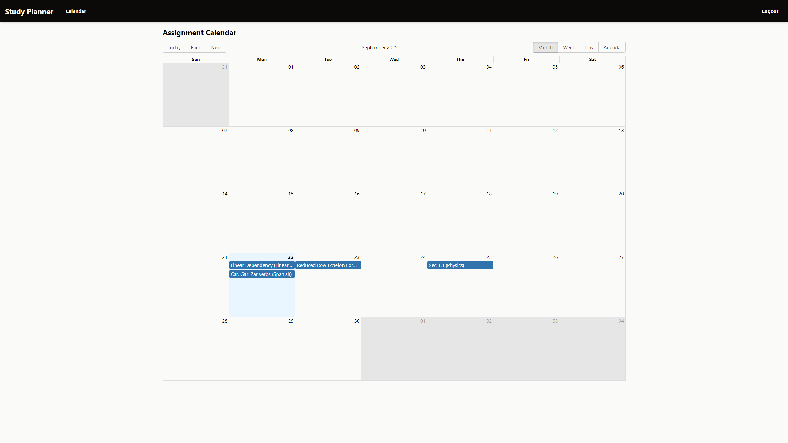

# Study Planner

A full-stack web application designed to help students organize their courses and assignments, featuring a dynamic calendar view and resource-finding capabilities.

**Live Demo:** https://study-planner-cyan-omega.vercel.app/

**Technologies:** React • Node.js • PostgreSQL • JWT • Docker • Tailwind CSS

---



*A screenshot of the main dashboard view.*



*A screenshot of the Find Resources page for the Car, Gar, Zar verbs assignment*



*A screenshot of the calendar on the monthly view, populated with the assignments*

---

## Features

- **User Authentication:** Secure user registration and login using JWT (JSON Web Tokens)
- **Full CRUD Functionality:** Users can create, read, update, and delete their own courses and assignments
- **Dynamic Calendar View:** All assignments with due dates are automatically populated onto an interactive monthly/weekly/daily calendar
- **External API Integration:** A "Find Resources" feature uses the YouTube Data API to find relevant study videos for any assignment
- **Polished User Experience:** Includes loading indicators and toast notifications for all asynchronous actions
- **Responsive Design:** Styled with Tailwind CSS for a clean and modern look

---

## Tech Stack

### Backend
- **Runtime:** Node.js
- **Framework:** Express.js
- **Database:** PostgreSQL
- **Authentication:** JWT, bcrypt
- **Testing:** Jest, Supertest
- **Deployment:** Render, Docker

### Frontend
- **Library:** React
- **Framework:** Vite
- **Styling:** Tailwind CSS
- **Routing:** React Router
- **State Management:** React Context API
- **API Client:** Axios
- **Calendar:** React Big Calendar
- **Deployment:** Vercel

---

## Local Setup and Installation

Follow these instructions to get the project running on your local machine.

### Prerequisites

- Node.js (v18 or later)
- Docker and Docker Desktop
- A code editor (e.g., VS Code)

### 1. Clone the Repository

```bash
git clone https://github.com/YOUR_USERNAME/YOUR_REPO_NAME.git
cd YOUR_REPO_NAME
```

### 2. Backend Setup

```bash
# Navigate to the backend directory
cd backend

# Install dependencies
npm install

# Create a .env file in the /backend directory with the following variables:
# DB_HOST=localhost
# DB_PORT=5432
# DB_USER=postgres
# DB_PASSWORD=your_chosen_password
# DB_NAME=postgres
# JWT_SECRET=your_jwt_secret
# YOUTUBE_API_KEY=your_youtube_api_key

# Start the PostgreSQL database in Docker
docker run -d --name my-postgres-db -e POSTGRES_PASSWORD=your_chosen_password -p 5432:5432 postgres

# Run the database schema to create tables
# (Connect to the Docker DB with a tool like pgAdmin and run the contents of /db/schema.sql)

# Start the backend server
npm start
```

### 3. Frontend Setup

```bash
# Navigate to the frontend directory from the root
cd frontend

# Install dependencies
npm install

# Create a .env file in the /frontend directory with the following variable:
# VITE_API_URL=http://localhost:3001

# Start the frontend development server
npm run dev
```

### 4. Environment Variables

#### Backend (.env)
```
DB_HOST=localhost
DB_PORT=5432
DB_USER=postgres
DB_PASSWORD=your_chosen_password
DB_NAME=postgres
JWT_SECRET=your_jwt_secret
YOUTUBE_API_KEY=your_youtube_api_key
```

#### Frontend (.env)
```
VITE_API_URL=http://localhost:3001
```

---

## Usage

1. **Register/Login:** Create an account or log in with existing credentials
2. **Add Courses:** Create courses for your current semester
3. **Manage Assignments:** Add assignments with due dates for each course
4. **View Calendar:** See all your assignments organized in a calendar view
5. **Find Resources:** Use the resource finder to discover relevant study materials on YouTube

---

## API Endpoints

### Authentication
- `POST /api/users/sign-up` - Register a new user
- `POST /api/users/login` - Login user

### Courses
- `GET /api/courses` - Get all user courses
- `POST /api/courses` - Create a new course
- `PUT /api/courses/:id` - Update a course
- `DELETE /api/courses/:id` - Delete a course

### Assignments
- `GET /api/assignments/all` - Get all user assignments
- `GET /api/courses/:courseID/assignments` - Get all assignments for a course
- `POST /api/courses/:courseID/assignments` - Create a new assignment
- `PUT /api/courses/:courseID/assignments/:id` - Update an assignment
- `DELETE /api/courses/:courseID/assignments/:id` - Delete an assignment

---

## Contributing

1. Fork the repository
2. Create a feature branch (`git checkout -b feature/amazing-feature`)
3. Commit your changes (`git commit -m 'Add some amazing feature'`)
4. Push to the branch (`git push origin feature/amazing-feature`)
5. Open a Pull Request

---

## Contact

Zaid Ahmed - zaahme18@gmail.com

Project Link: https://github.com/ZA1815/study-planner
